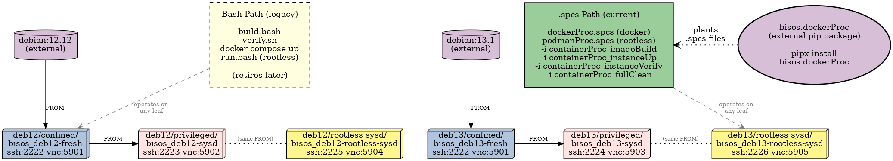

#+TITLE: bro_dockerfiles --- BISOS Docker Image Specifications (companion to =bisos.dockerProc=)
#+DATE: <2026-08-07 Thu>
#+AUTHOR: Mohsen BANAN
#+OPTIONS: toc:4

As a BRO (BISOS Repo Object), this repo contains Dockerfile specifications
for building BISOS Docker container images.

Images are organized along an *init/isolation profile* dimension --- three
peers describing how the container is initialized and how much privilege it
holds:

- *confined* :: Unprivileged containers. No systemd. VNC/noVNC/sshd started
  directly via =entrypoint.sh=. Safe to run anywhere; cgroup-version-agnostic.

- *privileged* :: Full =--privileged= containers (Docker) with systemd as
  PID 1. VNC/noVNC/sshd managed as systemd units. Socket activation works.
  Behaves as close to a VM as possible. Intended for trusted dev environments.

- *rootless-sysd* :: Same systemd-as-PID-1 image, but run under *rootless
  Podman* --- systemd fidelity *with* the unprivileged/userspace security
  posture (no =--privileged=). Requires a *cgroup v2* host. Intended for
  multi-tenant use (N engineers on one shared host).

The three peers are named by property, not by tool. See
[[#host-compatibility-cgroup-v1-vs-v2][Host Compatibility]] for which profile works on which host.

Each variant targets Debian 12 (Bookworm) and Debian 13 (Trixie).
All images provide an XFCE4 desktop accessible via TigerVNC and noVNC.

*Joint design with* [[https://github.com/bisos-pip/dockerProc][=bisos.dockerProc=]] *.*
This repo and the =bisos.dockerProc= pip package are *jointly designed* and
meant to be used together. =bisos.dockerProc= provides the framework
(planted =.spcs= files, path-derived parameters, seed CS commands);
=bro_dockerfiles= provides the image specifications (Dockerfiles, systemd
units, per-leaf assets) that the framework operates on. The two repos
evolve together. Today the bash scripts (=build.bash=, =verify.sh=,
=run.bash=) still work as a standalone alternative; a future release will
make =.spcs= the only path. The
[[#repo-structure-at-a-glance][Repo Structure at a Glance]] figure below
shows both parts of the pair.

* Repo Structure at a Glance

The figure below is a compact summary of everything in this repo: six
container image leaves arranged as a 2 x 3 grid, their =FROM= inheritance,
and the two build/verify paths available for each leaf. Scan the legend
first, then the figure.

*Legend:*

| Element                            | Meaning                                                                    |
|------------------------------------+----------------------------------------------------------------------------|
| Thistle cylinder (top)             | External Debian base image pulled from Docker Hub.                         |
| Light-blue leaf (=box3d=)          | *confined* profile leaf --- unprivileged docker, no systemd.               |
| Pink leaf (=box3d=)                | *privileged* profile leaf --- docker with =--privileged= + systemd PID 1.  |
| Khaki leaf (=box3d=)               | *rootless-sysd* profile leaf --- rootless podman + systemd PID 1.          |
| =FROM= arrow                       | Image inheritance. Confined images inherit from Debian; sysd variants inherit from confined. |
| =(same FROM)= dotted connector     | Privileged and rootless-sysd of the same release share their =FROM= base.  |
| Yellow rectangle (dashed border)   | *Bash path (legacy)* --- =build.bash= / =verify.sh= / =docker compose= / =run.bash=. Retires later. |
| Green rectangle                    | *=.spcs= path (current)* --- =dockerProc.spcs= / =podmanProc.spcs= via =bisos.dockerProc=.  |
| Thistle ellipse (right)            | =bisos.dockerProc= --- external pip package that provides the =.spcs= files. |
| Dotted "plants" arrow              | =bisos.dockerProc= plants =.spcs= files into every leaf.                   |
| Gray dashed "operates on" arrow    | Each path operates on *any* leaf (single edge drawn for legibility).       |

*Reading the figure, top to bottom:*

- *External Debian base images (top).* =debian:12.12= and =debian:13.1= are
  pulled from Docker Hub. Each feeds one *confined* leaf.
- *2 x 3 grid of leaves.* Rows are Debian release (12, 13); columns are
  init/isolation profile (confined, privileged, rootless-sysd). Within
  each row, the privileged and rootless-sysd leaves both =FROM= the same
  confined image --- so *building the confined image first* is the
  prerequisite for the two sysd variants.
- *Two build/verify paths (bottom-left).* Every leaf supports two ways
  of being built, verified, and run. The bash path (=build.bash=,
  =verify.sh=, =docker compose=, =run.bash=) works standalone --- no
  =bisos.dockerProc= install required, keeps the repo usable on its
  own. The =.spcs= path (=dockerProc.spcs= for docker leaves,
  =podmanProc.spcs= for rootless-sysd leaves) derives all parameters
  from the leaf's directory path via =bisos.dockerProc=. The bash path
  is dashed because it will be retired in a future release once the
  =.spcs= path has full parity.
- *=bisos.dockerProc= (bottom-right).* The *companion* pip package
  --- the framework side of this pair. =bro_dockerfiles= provides the
  image specifications; =bisos.dockerProc= provides the machinery that
  builds, runs, and verifies them. It plants =dockerProc.spcs= into
  confined + privileged leaves and =podmanProc.spcs= into
  rootless-sysd leaves. Once planted, each =.spcs= file is invoked
  directly from its leaf directory. Sources:
  [[https://github.com/bisos-pip/dockerProc]].

* Table of Contents     :TOC:
- [[#scope-of-this-repo][Scope of This Repo]]
- [[#repo-structure-at-a-glance][Repo Structure at a Glance]]
- [[#structure-of-this-repo][Structure of This Repo]]
- [[#images][Images]]
  - [[#confined][Confined]]
  - [[#privileged][Privileged]]
  - [[#rootless-sysd][Rootless-sysd]]
- [[#host-compatibility-cgroup-v1-vs-v2][Host Compatibility (cgroup v1 vs v2)]]
- [[#host-os--podman-version-for-rootless-sysd-debian-12-vs-13][Host OS / Podman Version for rootless-sysd (Debian 12 vs 13)]]
- [[#feature-parity-privileged-vs-rootless-sysd][Feature Parity: privileged vs rootless-sysd]]
- [[#building][Building]]
  - [[#two-build-paths-bash-and-bisosdockerproc][Two Build Paths (bash and =bisos.dockerProc=)]]
  - [[#local-only-workflow][Local-only Workflow]]
  - [[#running-inside-a-container-is-refused][Running Inside a Container Is Refused]]
  - [[#bash-path-per-profile-build-steps][Bash Path: Per-Profile Build Steps]]
  - [[#spcs-path-same-result-via-bisosdockerproc][=.spcs= Path: Same Result via =bisos.dockerProc=]]
- [[#running][Running]]
  - [[#port-assignments-host-ports][Port assignments (host ports):]]
- [[#connecting-to-a-container][Connecting to a Container]]
  - [[#via-vnc-client-recommended][Via VNC client (recommended):]]
  - [[#via-browser-novnc][Via browser (noVNC):]]
  - [[#via-ssh][Via SSH:]]
  - [[#credentials][Credentials:]]
- [[#installing-raw-bisos-inside-a-container][Installing Raw-BISOS Inside a Container]]
- [[#related-resources][Related Resources]]

* Scope of This Repo

Target Debian releases:

- [[https://www.debian.org/releases/bookworm/][Debian 12 (Bookworm)]]
- [[https://www.debian.org/releases/trixie][Debian 13 (Trixie)]]

All images provide:
- XFCE4 desktop environment
- TigerVNC server (port 5901 inside container)
- noVNC web client (port 6901 inside container)
- OpenSSH server (port 22 inside container)
- Base applications: Firefox ESR, Emacs, git, gedit, meld, synaptic
- Default user =bystar= / password =insecure= with passwordless sudo

* Structure of This Repo

#+BEGIN_SRC
debian/
  <majorRelease>/
    confined/vnc/xfce/<imageName>/
    privileged/vnc/xfce/<imageName>/
    rootless-sysd/vnc/xfce/<imageName>/
#+END_SRC

| Path                                                | Base image                 | Init          | Engine / posture          |
|-----------------------------------------------------+----------------------------+---------------+---------------------------|
| =debian/12/confined/vnc/xfce/bisos_deb12-fresh/=      | =debian:12.12=               | =entrypoint.sh= | docker, unprivileged      |
| =debian/12/privileged/vnc/xfce/bisos_deb12-sysd/=     | =bisos/deb12-fresh-vnc-xfce= | =systemd=       | docker, =--privileged=      |
| =debian/12/rootless-sysd/vnc/xfce/bisos_deb12-rootless-sysd/= | =bisos/deb12-fresh-vnc-xfce= | =systemd= | podman, rootless        |
| =debian/13/confined/vnc/xfce/bisos_deb13-fresh/=      | =debian:13.1=                | =entrypoint.sh= | docker, unprivileged      |
| =debian/13/privileged/vnc/xfce/bisos_deb13-sysd/=     | =bisos/deb13-fresh-vnc-xfce= | =systemd=       | docker, =--privileged=      |
| =debian/13/rootless-sysd/vnc/xfce/bisos_deb13-rootless-sysd/= | =bisos/deb13-fresh-vnc-xfce= | =systemd= | podman, rootless        |

Both the privileged and rootless-sysd images use the confined image as their
=FROM= base, adding only the systemd layer on top. Build the confined image
first. The privileged and rootless-sysd images share an identical build; they
differ only at run time (=--privileged= + cgroup mounts vs. rootless Podman's
native systemd integration).

Each image directory contains:

| File/Dir                          | Purpose                                              |
|-----------------------------------+------------------------------------------------------|
| File/Dir                            | Purpose                                              |
|-------------------------------------+------------------------------------------------------|
| =Dockerfile=                        | Image definition                                     |
| =docker-compose.yml=                | Convenience compose file for local use               |
| =build.bash=                        | Build and push multi-arch images to DockerHub        |
| =dockerProc.spcs=                   | (docker leaves) Planted Spread CS from =bisos.dockerProc=; drives build/run/verify from this dir |
| =podmanProc.spcs=                   | (rootless-sysd) Planted Spread CS; podman equivalent of =dockerProc.spcs= |
| =dockerConf/entrypoint.sh=          | (confined only) Starts VNC, noVNC, sshd directly     |
| =dockerConf/xstartup=               | (confined only) VNC xstartup launching XFCE4         |
| =dockerConf/panel.sh=               | (confined only) XFCE4 panel launcher config (NOTYET) |
| =dockerConf/panel.desktop=          | (confined only) Autostart entry for panel.sh         |
| =dockerConf/terminalrc=             | (confined only) XFCE4 terminal unicode settings      |
| =dockerConf/vncserver.service=      | (sysd) systemd unit for TigerVNC                     |
| =dockerConf/novnc.service=          | (sysd) systemd unit for noVNC                        |
| =dockerConf/sshd-container.service= | (sysd) systemd unit for sshd                         |
| =dockerConf/tmp-exec.service=       | (privileged) oneshot: remount =/tmp= exec at boot      |
| =docker-compose.cgv1.yml=           | (privileged only) cgroup-v1 host overlay             |
| =run.bash=                          | (rootless-sysd) =podman run= launcher                  |
| =*.container=                       | (rootless-sysd) Podman Quadlet unit (per-engineer)   |
| =verify.sh=                         | (sysd) host-side smoke test of a running container   |
| =raw-bisos= (symlink)               | (confined only) → =../../../../../../common/raw-bisos=; docker COPY follows symlink to bake =~/raw-bisos= into the image. Sysd variants inherit via =FROM=. |

* Images

** Confined

No systemd. Services started by =entrypoint.sh=, container stays alive via
=sleep infinity=. Can run on any Docker host without special privileges.

The =bystar= user is created with home directory mode *755* (overriding the
=useradd= default of 700 from =/etc/login.defs=). The privileged and
rootless-sysd images inherit this via their =FROM= base.

| Image                      |  Tag | Debian | DockerHub name                  |
|----------------------------+------+--------+---------------------------------|
| =bisos/deb12-fresh-vnc-xfce= | 1.21 |  12.12 | =bisos/deb12-fresh-vnc-xfce:1.21= |
| =bisos/deb13-fresh-vnc-xfce= |    4 |   13.1 | =bisos/deb13-fresh-vnc-xfce:4=    |

** Privileged

systemd as PID 1. Full socket activation, timers, journald, =systemctl= all
work. Requires a Debian 12/13 host with cgroupv2 (=cgroup2fs=) and Docker
Engine. Intended for trusted dev environments.

The privileged images layer on top of the confined images — build confined first.

| Image                     | Tag | Base image                      |
|---------------------------+-----+---------------------------------|
| =bisos/deb12-sysd-vnc-xfce= |   1 | =bisos/deb12-fresh-vnc-xfce:1.21= |
| =bisos/deb13-sysd-vnc-xfce= |   1 | =bisos/deb13-fresh-vnc-xfce:4=    |

On a cgroup-v1 host that cannot be moved to v2, use the =docker-compose.cgv1.yml=
overlay instead of =docker-compose.yml= (see [[#host-compatibility-cgroup-v1-vs-v2][Host Compatibility]]).

*Docker tmpfs and =/tmp=.* Docker's =tmpfs:= shorthand mounts =/tmp= with =noexec=
by default --- unlike Debian's own =/tmp= which is exec. The privileged images
include a =tmp-exec.service= systemd oneshot that runs =mount -o remount,exec /tmp=
early at boot (after =local-fs.target=, before =sysinit.target=), restoring
Debian's default behaviour. The confined images are not affected (their =/tmp= is
on the container's overlayfs root, not a Docker tmpfs mount).

** Rootless-sysd

The same systemd image as privileged, but run under *rootless Podman* --- no
=--privileged=, no host =/sys/fs/cgroup= bind mount. Podman's native systemd
integration (=--systemd=always=) does the cgroup subtree delegation and tmpfs
plumbing inside the launching user's namespace. Container root maps to the
engineer's unprivileged host UID. *Requires a cgroup v2 host with delegation.*

| Image                              | Tag | Base image                      |
|------------------------------------+-----+---------------------------------|
| =bisos/deb12-rootless-sysd-vnc-xfce= |   1 | =bisos/deb12-fresh-vnc-xfce:1.21= |
| =bisos/deb13-rootless-sysd-vnc-xfce= |   1 | =bisos/deb13-fresh-vnc-xfce:4=    |

Host prerequisites (Debian): =podman crun uidmap fuse-overlayfs
dbus-user-session slirp4netns passt=. Enable cgroup v2 controller delegation
for the user session (=Delegate=cpu io memory pids= drop-in on
=user@.service=).

*Two run paths for the same image:* =run.bash= is a direct =podman run= for
quick, one-off *testing*; the Quadlet =*.container= unit is the *persistent,
per-engineer* form (=systemctl --user start/enable= + =loginctl enable-linger=)
for the multi-tenant "N engineers on one host" model --- it survives logout and
starts at login/boot.

Before building, verify host readiness with =podmanHostVerify.cs -i verify=
(installed by =bisos.dockerProc=; prints GO/NO-GO with per-check PASS/WARN/FAIL).
Note: rootless Podman needs a real user session --- log in as the user directly
(not =su=), or crun's systemd cgroup manager fails with an
=sd-bus ... Input/output error=.

* Host Compatibility (cgroup v1 vs v2)

Which profile works depends on the *host* cgroup version. You cannot switch
v1 <-> v2 at runtime (it is chosen at boot). Check with:

#+BEGIN_SRC bash
stat -fc %T /sys/fs/cgroup      # cgroup2fs = v2 ; tmpfs = v1/hybrid
#+END_SRC

| Profile         | cgroup v1 host                          | cgroup v2 host |
|-----------------+-----------------------------------------+----------------|
| confined        | works                                   | works          |
| privileged sysd | works via =docker-compose.cgv1.yml= overlay | works (=.yml=)   |
| rootless-sysd   | *does not work* (no v1 rootless deleg.)   | works          |

Notes:
- *rootless-sysd requires cgroup v2.* cgroup v1 has no safe delegation model,
  so rootless systemd-as-PID-1 and rootless resource limits do not work.
- *privileged sysd works on v1* with the =docker-compose.cgv1.yml= overlay:
  mounts =/sys/fs/cgroup:ro= + =/sys/fs/cgroup/systemd:rw= and omits
  =cgroup: host=. Still needs =--privileged=.
- *RHEL 8* defaults to v1/hybrid; flip with
  =grubby --update-kernel=ALL --args="systemd.unified_cgroup_hierarchy=1"= +
  reboot. If the host cannot be rebooted, use the v1 overlay (privileged) or
  provision a fresh v2 instance (RHEL 9 / Amazon Linux 2023 default to v2).

* Host OS / Podman Version for rootless-sysd (Debian 12 vs 13)

The rootless-sysd variant's smoothness depends on the *host's* Podman/crun
version, which tracks the host Debian release. (The container is Debian 12/13
either way; this is about the machine running podman.)

| Host        | Podman | rootless-sysd experience                            |
|-------------+--------+-----------------------------------------------------|
| Debian 12   | 4.3.1  | works, with two old-Podman bugs accommodated below  |
| Debian 13   | 5.4.2  | clean --- the accommodations are unnecessary        |

On a *Debian 12 host* (older Podman/crun) two bugs surface; both are worked
around in this repo so it still functions:
- *Build:* buildah's per-RUN transient scope fails with
  =sd-bus ... org.freedesktop.systemd1 ... Input/output error=. =build.bash=
  passes =--isolation=chroot= to sidestep it (image layers are identical).
- *Runtime:* =podman exec= into the systemd container fails with a nested
  =cgroup.procs= "Permission denied". So =verify.sh= is *exec-free* (host-side
  checks + an SSH session), and you manage the container over SSH, not exec.

On a *Debian 13 host* (Podman 5.4.2) both are fixed: =--isolation=chroot= is
unnecessary (but harmless) and =podman exec= works. The workarounds are kept
so the *same scripts run unchanged* on a Debian 12 or 13 host.

Requirements that apply on *both* (not Podman-version issues):
- cgroup v2 host with controller delegation (rootless needs it).
- a real user *login* session (not =su=) + =loginctl enable-linger= for the
  persistent Quadlet per-engineer model.
- Podman store (graphroot) on a large *local* disk --- not =/= if it is
  near-full, and never NFS (overlay is unreliable on NFS). Set via
  =~/.config/containers/storage.conf=.
- =polkit.service= is masked in the sysd images: it fails inside the Debian
  guest (no seat/session) and would otherwise leave systemd =degraded=,
  regardless of host.

Run =podmanHostVerify.cs -i verify= (from =bisos.dockerProc=) to check these
before building.

* Feature Parity: privileged vs rootless-sysd

Setting aside the security and multi-tenant differences: both are
systemd-PID-1 containers, so *all systemd service-management features are
identical* between them. They diverge only for workloads that reach through
the container into the host *kernel/hardware* --- exactly what =--privileged=
unlocks and a rootless user namespace cannot grant.

*Identical in both* (no functional difference): systemd units + dependency
ordering + =Restart=, *socket activation* (=.socket= units, e.g. nginx/Django),
timers, journald, CPU/memory/PID resource limits, running servers/DBs/web apps
(Airflow, Postgres, nginx, gunicorn/uvicorn), Unix sockets, tmpfs on =/run=,
binding low ports *inside* the container.

*Works in privileged, fails/limited under rootless-sysd:*

| Capability a service might need                              | privileged | rootless-sysd |
|--------------------------------------------------------------+------------+---------------|
| Load kernel modules (=modprobe=)                               | yes        | no (hard wall) |
| Mount real/loop/block filesystems; =.mount=/automount units    | yes        | no (tmpfs/bind/fuse only) |
| systemd =RootImage=/=MountImage=/portable services             | yes        | no |
| Create/access device nodes (=mknod=, raw disk, GPU)            | yes        | no |
| =/dev/kvm= nested VMs, =/dev/net/tun= kernel VPNs              | yes        | only if device explicitly passed + permitted |
| Write =sysctl= / =/proc/sys= (e.g. =ip_forward=)              | yes        | no (mostly read-only) |
| Kernel networking: bridges, NAT, nftables modules, networkd  | yes        | limited (slirp4netns/pasta userns) |
| Set the system clock (=settimeofday=/timesyncd stepping)       | yes        | no (hard wall) |
| Device cgroup (=DeviceAllow=) and block-I/O limits (=IOWeight=) | yes      | no (controllers not delegated) |
| Write to =/sys= (hardware/kernel knobs)                        | yes        | no (mostly read-only) |
| Docker-in-Docker / full nested runtimes                      | yes        | heavily constrained |

Nuance: some rootless gaps can be selectively re-opened by the host
(=--device=, =--cap-add=, =--sysctl=, device-group membership); others can
*never* be granted to a rootless user (kernel modules, =settimeofday=, mounting
arbitrary block devices).

*Rule of thumb:* userland + systemd → both are equal; needs the kernel to do
something privileged on real hardware → only the privileged image can.

* Building

** Two Build Paths (bash and =bisos.dockerProc=)

Every leaf directory supports *two build/verify paths* that produce the same
result. Which one you use is a workflow choice today; the =.spcs= path is
scheduled to become the only path later.

- *Bash path (legacy, standalone).* =./build.bash= to build, =./verify.sh= to
  smoke-test, =docker compose up -d= / =./run.bash= to run. Works without
  =bisos.dockerProc= installed. Keeps =bro_dockerfiles= usable as a
  standalone repo.

- *=.spcs= path (current, framework-driven).* =./dockerProc.spcs -i
  containerProc_imageBuild= (or =./podmanProc.spcs= for rootless-sysd
  leaves), =-i containerProc_instanceUp=, =-i containerProc_instanceVerify=,
  =-i containerProc_instanceDelete=, etc. Requires =pipx install
  bisos.dockerProc=. Derives engine, profile, ports, and base image from
  the leaf's directory path --- no per-leaf configuration. Cmnds are
  organized by noun: =image*= for the built artefact, =instance*= for the
  running container, =fullClean= for a combined teardown.

The two paths coexist. Same Dockerfile, same layers, same running container
--- the =.spcs= wrapper mostly just calls the same underlying =docker= /
=podman= commands with the right arguments derived from the path. Later
releases will retire the bash path once the =.spcs= path has full parity
across all supported flows.

** Local-only Workflow

These images are meant to be built and used *locally*, not pushed to DockerHub.
For the bash path, always use =./build.bash -d= (local build); the bare
=./build.bash= (multi-arch buildx/manifest → DockerHub) path is not the
intended flow here. The =.spcs= path is local-only by design.

*Docker and Podman keep separate image stores.* The image format is identical
(OCI), but the two engines do **not** share a local cache:
- Docker: root daemon store under =/var/lib/docker/=.
- Rootless Podman: per-user store under =~/.local/share/containers/storage/=.
So an image built under one engine is invisible to the other --- even on the
same host, same user. Build each variant with the engine you will run it with:
docker variants (confined, privileged) with docker; the rootless-sysd variant
with podman. To move an already-built image between stores without a registry:
=docker save  | podman load= (or the reverse).

** Running Inside a Container Is Refused

The =.spcs= path detects if it is running inside a container (via
=/.dockerenv=, =/run/.containerenv=, and =/proc/1/cgroup= markers) and
refuses with a clear error. This package assumes the Container Platform is
a host, not itself a container --- nested containers are not a supported
configuration. The bash path does not check, but nested docker/podman
generally does not work without special host setup either.

** Bash Path: Per-Profile Build Steps

*** Confined (build first)

#+BEGIN_SRC bash
cd debian/12/confined/vnc/xfce/bisos_deb12-fresh
./build.bash -d          # local build (docker) --- the intended flow
# for the rootless-sysd chain, build the base with podman instead:
#   podman build -t bisos/deb12-fresh-vnc-xfce:1.21 .
#+END_SRC

*** Privileged (requires confined image available locally or on DockerHub)

#+BEGIN_SRC bash
cd debian/12/privileged/vnc/xfce/bisos_deb12-sysd
./build.bash -d
#+END_SRC

*** Rootless-sysd (Podman; requires confined image available)

#+BEGIN_SRC bash
cd debian/12/rootless-sysd/vnc/xfce/bisos_deb12-rootless-sysd
./build.bash -d          # podman build (local)
#+END_SRC

Same pattern for Debian 13 under =debian/13/=.

** =.spcs= Path: Same Result via =bisos.dockerProc=

The =.spcs= file is already planted in every leaf. From any leaf, invoke
it directly --- the leaf's path supplies engine, profile, and ports.

*** Confined (build first)

#+BEGIN_SRC bash
cd debian/12/confined/vnc/xfce/bisos_deb12-fresh
./dockerProc.spcs -i containerProc_imageBuild           # with layer cache
./dockerProc.spcs -i containerProc_imageBuild --noCache="true"
#+END_SRC

*** Privileged

#+BEGIN_SRC bash
cd debian/12/privileged/vnc/xfce/bisos_deb12-sysd
./dockerProc.spcs -i containerProc_imageBuild
#+END_SRC

*** Rootless-sysd

#+BEGIN_SRC bash
cd debian/12/rootless-sysd/vnc/xfce/bisos_deb12-rootless-sysd
./podmanProc.spcs -i containerProc_imageBuild
#+END_SRC

Run =./dockerProc.spcs= or =./podmanProc.spcs= with no arguments in any leaf
to see the full menu, filtered to just the commands relevant to that leaf.
Cmnds fall into two noun-prefixed groups plus a combined command:

- =containerProc_image*= --- =imageBuild=, =imageDelete=
- =containerProc_instance*= --- =instanceUp=, =instanceDown=, =instanceDelete=,
  =instanceRestart=, =instancePs=, =instanceLogs=, =instanceExec=,
  =instanceVerify=, =instanceStatus=
- =containerProc_fullClean= --- =instanceDelete= + =imageDelete= combined

For the full design and the multi-tenant registrar picture (design-only in
this phase), see
=/bisos/git/auth/bxRepos/bisos-pip/dockerProc/README.org=.

* Running

#+BEGIN_SRC bash
# confined / privileged (Docker)
cd debian/12/confined/vnc/xfce/bisos_deb12-fresh
docker compose up -d

cd debian/12/privileged/vnc/xfce/bisos_deb12-sysd
docker compose up -d                              # cgroup v2 host
docker compose -f docker-compose.cgv1.yml up -d   # cgroup v1 host

# rootless-sysd (Podman, cgroup v2 host)
cd debian/12/rootless-sysd/vnc/xfce/bisos_deb12-rootless-sysd
./run.bash
#+END_SRC

The current directory is mounted into the container at =/shuttle/this=. After a
container is up, =./verify.sh= (in each sysd image dir) smoke-tests it from the
host --- systemd is PID 1, services active, journald live, ports listening.

** Port assignments (host ports):

| Container            | SSH  | VNC  | noVNC |
|----------------------+------+------+-------|
| deb12-confined       | 2222 | 5901 | 6901  |
| deb12-privileged     | 2223 | 5902 | 6902  |
| deb12-rootless-sysd  | 2225 | 5904 | 6904  |
| deb13-confined       | 2222 | 5901 | 6901  |
| deb13-privileged     | 2224 | 5903 | 6903  |
| deb13-rootless-sysd  | 2226 | 5905 | 6905  |

* Connecting to a Container

** Via VNC client (recommended):

Connect to =localhost:<vncPort>=. No password required.

** Via browser (noVNC):

Open =http://localhost:<novncPort>= in a browser.

** Via SSH:

#+BEGIN_SRC bash
ssh -p <sshPort> bystar@localhost
#+END_SRC

** Credentials:

- Username: =bystar=  Password: =insecure=
- Passwordless sudo inside the container.

* Installing Raw-BISOS Inside a Container

The Raw-BISOS bootstrap payload (=installRawBisos.sh=, =postRawBisos.sh=,
=raw-bisos.sh=) is *baked into every image* at =~/raw-bisos= --- no host
mount needed. Single canonical source at =bro_dockerfiles/common/raw-bisos/=,
symlinked into each confined leaf's build context, then =COPY=-ed into the
image by the confined Dockerfile. Privileged and rootless-sysd variants
inherit =~/raw-bisos= via =FROM= the confined image.

After starting a container, exec/ssh in and run:

#+BEGIN_SRC bash
docker exec -it <containerName> bash    # or: ssh -p <sshPort> bystar@localhost
cd ~/raw-bisos
bash installRawBisos.sh
#+END_SRC

This downloads and runs the standard bxGenesis Raw-BISOS installer.
See https://github.com/bxGenesis/start for details.

After installation, run =postRawBisos.sh= to wire up =~/.bashrc= and set
ownership of =/shuttle/this=.

*Updating the payload.* To change the bootstrap scripts, edit files under
=bro_dockerfiles/common/raw-bisos/= (single canonical location) and rebuild
the confined image. The change flows to privileged and rootless-sysd via
their =FROM= inheritance --- rebuild them too if you want the update to
land in those variants.

* Related Resources

- =bisos.dockerProc= (companion pip package): https://github.com/bisos-pip/dockerProc
- BISOS Bootstrap: https://github.com/bxGenesis/start
- TigerVNC: https://tigervnc.org
- noVNC: https://novnc.com
