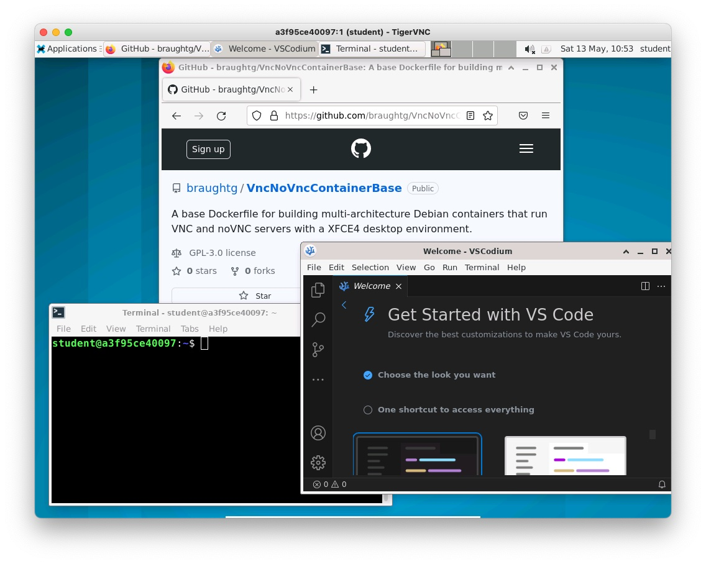

# VncNoVncContainerBase

A base `Dockerfile` for building multi-architecture Debian images containing VNC and noVNC servers and an XFCE4 desktop environment.

Images such as these are ideal for building images for development environments or courses .  For example:
* An environment for teaching the linux/Unix command line.
* Providing a web server, database and API handler (e.g. express) for a web development course.
* Providing particular compilers, assemblers, etc... for a course that requires specialized tools.
* Etc.



## Using the Image

The base image generated by this repo can be used as is, or more likely it can be used as the base image (i.e. `FROM`) for creating new images for specialized purposes.  

The [CourseContainerTemplate](https://github.com/braughtg/CourseContainerTemplate) repository provides a good starting point for creating containers for courses.  It is recommended that you visit that repo and consider using it rather than using this repo directly. 

## Requirements

The requirements for using the image produced are:
* [Docker Desktop](https://docs.docker.com/desktop/install/windows-install/)
  * Or [Docker Engine on Linux](https://docs.docker.com/engine/install/)
* A VNC client (recommended)
  * E.g. [Tiger VNC](https://sourceforge.net/projects/tigervnc/files/stable/)
  * Note: The noVNC server allows the container to be accessed via a web browser.  However, the user experience is much better when using a full VNC client.

## The Image

A multi-architecture image (`linux/amd64`, `linux/arm64`) generated from this repo is available at on dockerhub at:

[`braughtg/vnc-novnc-base`](https://hub.docker.com/r/braughtg/vnc-novnc-base/tags)


### Getting the image:

The image can be pulled from dockerhub by adapting the following command:

```
docker pull <dockerhub user>/<image>:<tag>
```

For example:
```
docker pull braughtg/vnc-novnc-base:1.2.0
```

### Creating the container:
The container can be created without pulling or after pulling by adapting the following command:

```
docker create --name <container name> --publish 5901:5901 --publish 6901:6901 <dockerhub user>/<image>:<tag>
```

For example:
```
docker create --name vnc --publish 5901:5901 --publish 6901:6901 braughtg/vnc-novnc-base:1.2.0
```

### Starting the container:
The container can be run from the Docker Desktop application or by adapting the following command:

```
docker start <container name>
```

For example:
```
docker start vnc
```

### Connecting to the container:

You can connect to the container and interact with the Debian system through the XFCE4 desktop either by using an VNC client or via a browser using noVNC.  The user experience is significantly better when using a VNC client.  In particular, when connecting with noVNC copy and paste between the host machine and the Debian system in the container is inconvenient. 

#### Connecting with a VNC client

To connect to the container using a VNC Client, start your VNC Client and connect to:
```
localhost:5901
```
  
The XFCE4 desktop should appear in the VNC Client window.

#### Connecting via a browser

To connect to the container using a browser, open the browser and connect to: 
```
https://localhost:6901
```

The XFCE4 desktop should appear in the browser window.  

Some tips for using the container via noVNC:
* The noVNC menu (the little tab on the left side of the desktop) provides some helpful functionality.
* To copy/paste between the host machine and the container you must use the clipboard accessed via the noVNC menu. This is a little inconvenient, but it is functional.
* To enable the XFCE4 desktop to scale with the browser window, use the settings (the the gear) on the noVNC menu to set the “Scaling Mode” to “Remote Resizing.”

#### Credentials
When connected to the container via VNC or noVNC the default (non-root) user is automatically logged in.  No credentials will need to be provided to connect to the client. However, the user also has `sudo` privileges within the container and the password will be required to run commands with `sudo`.

By default this user has the following credentials:
* Username: `student`
* Password: `student`

The credentials for this (non-root) user are set by `ARGs` within the `Dockerfile` and thus can be modified as desired.

### Stopping the container:

The container may be stopped from the Docker Desktop application or by adapting the following command:

```
docker stop <container name>
```

For example:
```
docker stop vnc
```

## Building an image:

The `build.bash` script will build either a single architecture image locally or will build multi-architecture images and push them to dockerhub.

### Building an image locally:

Use the following command to build a single architecture matching the host machine architecture locally:
```
./build.bash -d
```

### Building and pushing multi-architecture images:

1. Edit the variables at the top of the `build.bash` script to suit your needs.

```
# Modify the following variables as appropraite when building new base inmages.
DOCKER_HUB_USER="braughtg"
IMAGE="vnc-novnc-base"
TAG="1.2.0"
PLATFORMS=linux/amd64,linux/arm64
```

2. In the terminal, log into the dockerhub account in the `DOCKER_HUB_USER` so that the images can be pushed.

3. Then use the command:
```
./build.bash
```

### Additional Information

#### Running tasks on startup

When started the container produced runs the `startup.bash` script.  This script starts the VNC and noVNC servers and does a little additional housekeeping.  It then looks for a script `/home/student/.contconf/launch.bash`.  If that script is found it will be run.  That scrip should run only background tasks (e.g. starting services and servers) and then exit.  By default there is no `/home/student/.contconf/launch.bash` script installed.  However, the [CourseContainerTemplate](https://github.com/braughtg/CourseContainerTemplate) repository provides an empty one by default that is copied into the image that it produces.

#### Preserving the users home directory:

The container created by the above command works well for most basic use cases. It persists changes to the container (e.g. user installed software, changes within the user home directory) in the writeable layer of the container.  Thus, all changes are preserved across container stops and starts, so long as the container is not deleted.  If the container is deleted all changes will be lost. 

IF greater persistence is desired it is possible to preserve the changes within the user's home directory across container deletions using either a Docker volume or within the file system of the host machine.  

To preserve the home directory in a Docker Volume adapt the following `mount` flag and add it to the `docker create` command above:

```
--mount type=volume,source=<volume name>,target=/home/<username>
```

For example:
```
--mount type=volume,source=vncVol,target=/home/student
```

To preserve the home directory on the host machine file system adapt the following `mount` to the `docker create` command above:

```
--mount type=bind,source=<directory name>,target=/home/<username>
```

For example:
```
--mount type=bind,source=./vncDir,target=/home/student
```

#### Using Docker within the container:

By default Docker is not installed within the container.  If you plan to use Docker Desktop or the docker engine within a container you will need to:

* Add commands to the `Dockerfile` to install docker.
* Add the following `mount` to the `docker create` command above:
  * For Linux or MacOS:
    ```
    --mount type=bind,source=/var/run/docker.sock,target=/var/run/docker.sock
    ```
  * For Windows:
    ```
    --mount type=bind,source=//var/run/docker.sock,target=/var/run/docker.sock
    ```